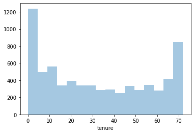

# Predictive Analysis of Customers' Churn

## Project Overview or Summary

In the fast-paced world of telecommunications, retaining customers is of utmost importance. This project embarks on the journey to predict customer churn, a metric that delineates the rate at which customers stop using a service. By harnessing a detailed dataset, we aim to pinpoint key patterns and signals that could indicate an impending customer exit. Predicting churn is pivotal as retaining an existing customer often proves more cost-effective than acquiring a new one.

## Results or Findings (In-depth)

- **Churn Distribution:** The dataset predominantly features customers who did not churn, with 5,174 non-churn instances and 1,869 churn cases. This distribution is presented through bar and pie charts.
- **Gender Distribution:** Gender-wise, the dataset is fairly balanced, with 3,555 male customers and 3,488 female customers. Again, bar and pie charts provide a clear view.
- **Tenure Analysis:** A distribution plot indicates customer tenure, revealing the span customers have been associated with the company.

- The model's overall accuracy stands at 0.82, showcasing a competent ability to predict customer churn.

.png)
.png)

## The Data Description

The dataset at the heart of this analysis provides an exhaustive view of a telecommunication company's customer base:
- **Context:** The primary goal is to predict behavioral patterns to retain customers. This is achieved by analyzing pertinent data and formulating targeted retention strategies.
- **Content:** Each row signifies a unique customer, with columns detailing diverse attributes like:
  - Churn status (denoting if a customer left within the last month).
  - Various services subscribed to by the customer (e.g., phone, internet, online security).
  - Account details such as tenure, contract type, payment method, charges, etc.
  - Demographics: gender, age, partner status, dependents, etc.

## Analysis of the Data

The first step involves a thorough data cleaning process, ensuring accuracy and consistency. This sets the stage for a deep exploratory data analysis and subsequent modeling.

### Data Cleaning and Preprocessing

The data's integrity is of paramount importance. Several steps were undertaken to ensure the data is consistent and accurate:
- Addressing missing values.
- Handling outliers or anomalous values.

### Data Visualization

Visual aids were heavily used to understand various patterns:
- **Churn Distribution:** The dataset predominantly features customers who did not churn, with 5,174 non-churn instances and 1,869 churn cases. This distribution is presented through bar and pie charts.
- **Gender Distribution:** Gender-wise, the dataset is fairly balanced, with 3,555 male customers and 3,488 female customers. Again, bar and pie charts provide a clear view.
- **Tenure Analysis:** A distribution plot indicates customer tenure, revealing the span customers have been associated with the company.

.png)
.png)
.png)
.png)
.png)
.png)
.png)

## Modeling: The Math's Behind The Metrics Used

The project's core lies in predicting customer churn. Various machine learning algorithms might be employed for this purpose, with logistic regression being a probable candidate, given the binary nature of the churn outcome.
- **Logistic Regression:** Suitable for binary classification tasks, this model predicts the probability of a customer churning.

### Performance Metrics:

- For non-churn predictions:
  - Precision: 0.85
  - Recall: 0.91
  - F1-score: 0.88
- For churn predictions:
  - Precision: 0.69
  - Recall: 0.56
  - F1-score: 0.62
- The model's overall accuracy stands at 0.82, showcasing a competent ability to predict customer churn.

## Requirements

- **Libraries Used:** 
  - Data Manipulation: `numpy`, `pandas`
  - Visualization: `matplotlib`, `seaborn`
  - Machine Learning: `sklearn`
- **Software Version:** Python 3.x
- **Data Sources:** The dataset can be accessed from [Kaggle](https://www.kaggle.com/blastchar/telco-customer-churn/download).
